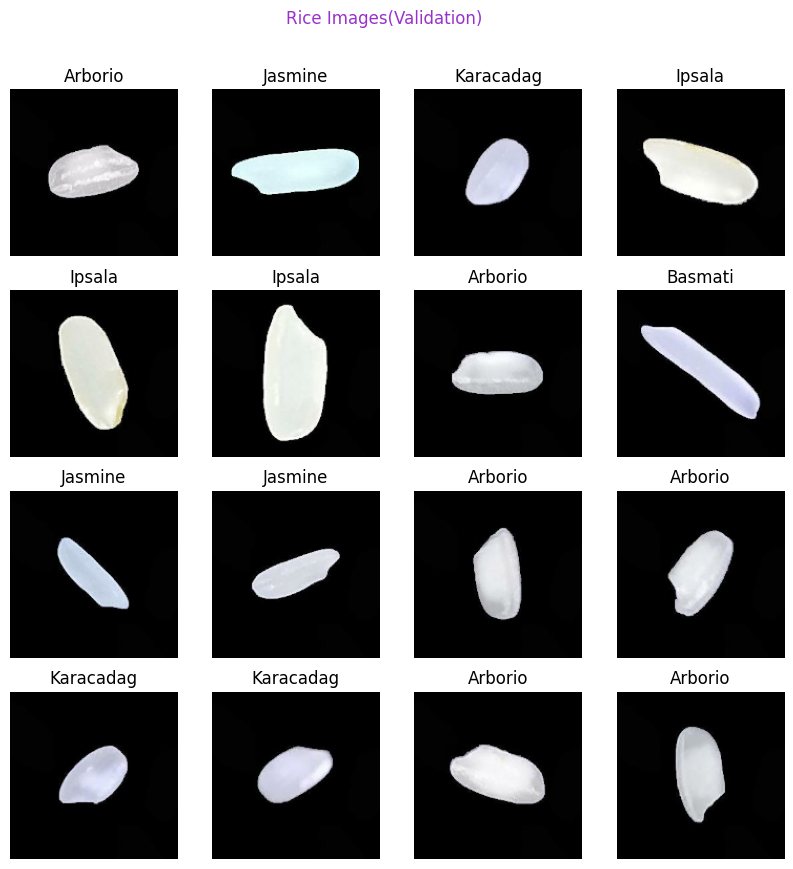
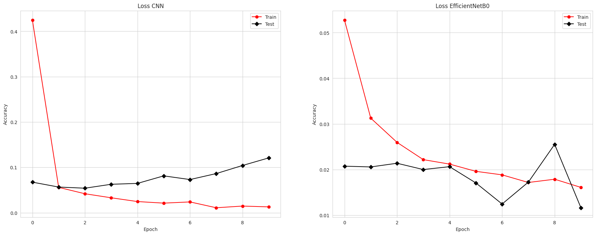

# Final Project - Rice Classification

## Latar Belakang
Beras adalah salah satu makanan pokok terutama untuk Bangsa Indonesia. Kalau tidak makan nasi (beras yang sudah dimasak) serasa belum makan. Oleh sebab itu menjadi penting untuk mendapatkan jenis beras yang memiliki kualitas bagus. 
Perlunya sistem yang menjaga kualitas beras yang baik menjadi pertimbahan agar membuat repository ini. Oleh karena itu dibuat proejct Rice Classification using CNN and EfficentNetB0.

## Informasi Umum
Dalam Repository ini saya mencoba implementasikan CNN([paper](https://arxiv.org/abs/1511.08458)|[code](https://www.tensorflow.org/tutorials/images/cnn)) dan EfficentNetB0([paper](https://arxiv.org/abs/1905.11946v5)|[code](https://github.com/lukemelas/EfficientNet-PyTorch/blob/2eb7a7d264344ddf15d0a06ee99b0dca524c6a07/efficientnet_pytorch/model.py#L143)) sedangkan untuk dataset [rice](https://www.kaggle.com/datasets/muratkokludataset/rice-image-dataset).
Dataset rice ini memiliki 5 kelas yakni Arborio, Basmati, Ipsala, Jasmin, dan Karacadag. Berikut sample datasetnya:  
Sampel Data Training  
 
Sampel Data Validation  
  
Sampel Data Test  

## Langkah-langkah
Proses implementasi:
1. Mount Google Drive
2. Extract dataset dengan extension .zip yang ada pada Google Drive
3. Import library-library
4. Split / bagi dataset dengan perbandingan Train : Vallidation : Test = 7 : 2 : 1 dengan Batch_Size = 20  dan Image_size = (160, 160)
5. Membuat Model CNN dan EfficentNetB0
6. Membuat fungsi evaluasi
7. Melakukan training model dengan epoch 10
8. Melakukan evaluasi model

## Hasil Uji
Grafik Accuracy CNN dan EfficentNetB0

Grafik Loss CNN dan EfficentNetB0

Classification Report CNN  
  

Classification Report EfficentNetB0  
  

Confusion Matrix CNN  
  

Confusion Matrix EfficentNetB0  
  

## Hasil Prediction
CNN

EfficentNetB0

## Kesimpulan
Dapat disimpulkan bahwa EfficentNetB0 memiliki akurasi lebih baik daripada CNN. Namun waktu training CNN lebih cepat daripada waktu training EfficentNetB0 karena jumlah parameter CNN lebih kecil daripada EfficentNetB0.

## Pengembangan di Masa Depan
Beberapa buah pikiran yang sekiranya bisa digunakan untuk pengembangan di masa depan yakni:
1. Mengembangkan dataset, dataset yang digunakan untuk project ini berupa 1 beras dengan background gelap. Kedepannya bisa menggunakan dataset dengan banyak beras dengan background yang dinamis.
2. Segmentasi, melakukan segmentasi pada dataset yang lebih variatis agar implement ke dunia nyata lebih implementatif.
